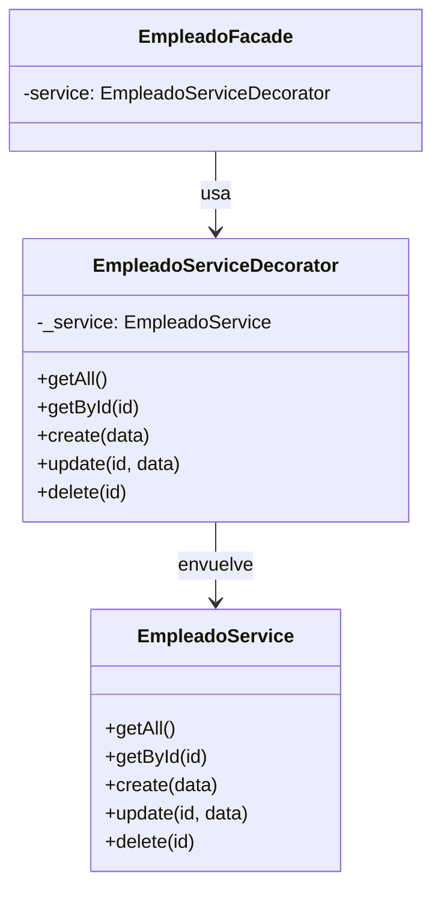

# Diagrama Decorator — Logging de EmpleadoService

```mermaid
classDiagram
    class EmpleadoService {
        +getAll()
        +getById(id)
        +create(data)
        +update(id, data)
        +delete(id)
    }

    class EmpleadoServiceDecorator {
        -_service: EmpleadoService
        +getAll()
        +getById(id)
        +create(data)
        +update(id, data)
        +delete(id)
    }

    class EmpleadoFacade {
        -service: EmpleadoServiceDecorator
    }

    EmpleadoServiceDecorator --> EmpleadoService : envuelve
    EmpleadoFacade --> EmpleadoServiceDecorator : usa
```
