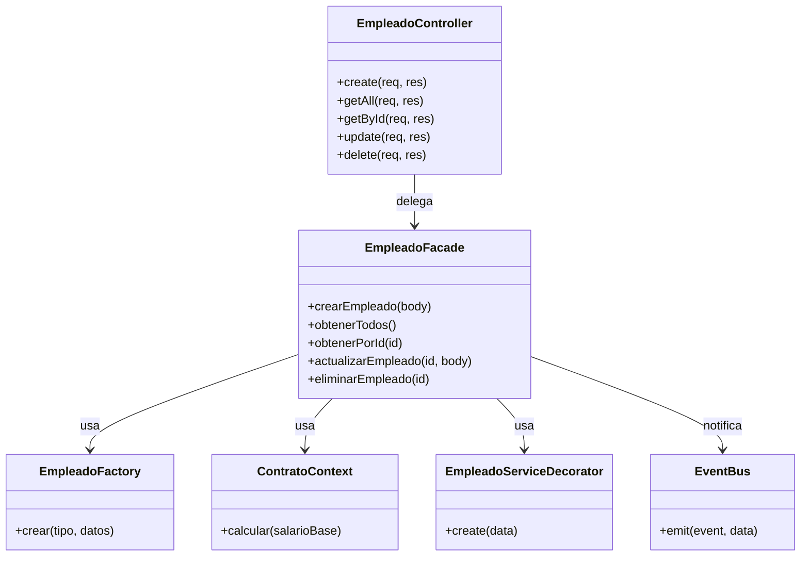

# Diagrama Facade — EmpleadoFacade

```mermaid
classDiagram
    class EmpleadoController {
        +create(req, res)
        +getAll(req, res)
        +getById(req, res)
        +update(req, res)
        +delete(req, res)
    }

    class EmpleadoFacade {
        +crearEmpleado(body)
        +obtenerTodos()
        +obtenerPorId(id)
        +actualizarEmpleado(id, body)
        +eliminarEmpleado(id)
    }

    class EmpleadoFactory {
        +crear(tipo, datos)
    }

    class ContratoContext {
        +calcular(salarioBase)
    }

    class EmpleadoServiceDecorator {
        +create(data)
    }

    class EventBus {
        +emit(event, data)
    }

    EmpleadoController --> EmpleadoFacade : delega
    EmpleadoFacade --> EmpleadoFactory : usa
    EmpleadoFacade --> ContratoContext : usa
    EmpleadoFacade --> EmpleadoServiceDecorator : usa
    EmpleadoFacade --> EventBus : notifica
```
