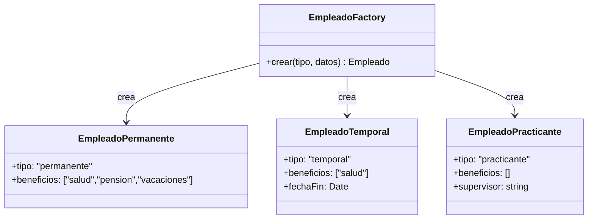

# Diagrama Factory Method — Empleados

```mermaid
classDiagram
    class EmpleadoFactory {
        +crear(tipo, datos) Empleado
    }

    class EmpleadoPermanente {
        +tipo: "permanente"
        +beneficios: ["salud","pension","vacaciones"]
    }

    class EmpleadoTemporal {
        +tipo: "temporal"
        +beneficios: ["salud"]
        +fechaFin: Date
    }

    class EmpleadoPracticante {
        +tipo: "practicante"
        +beneficios: []
        +supervisor: string
    }

    EmpleadoFactory --> EmpleadoPermanente : crea
    EmpleadoFactory --> EmpleadoTemporal : crea
    EmpleadoFactory --> EmpleadoPracticante : crea
```
