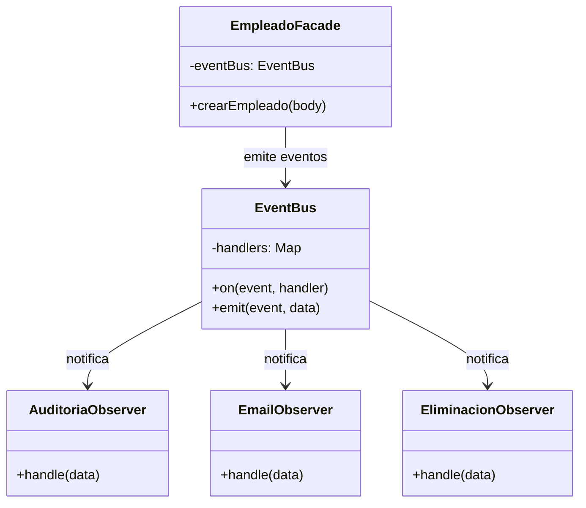

# Diagrama Observer — Eventos de Empleado

```mermaid
classDiagram
    class EmpleadoFacade {
        +crearEmpleado(body)
        -eventBus: EventBus
    }

    class EventBus {
        +on(event, handler)
        +emit(event, data)
        -handlers: Map
    }

    class AuditoriaObserver {
        +handle(data)
    }

    class EmailObserver {
        +handle(data)
    }

    class EliminacionObserver {
        +handle(data)
    }

    EmpleadoFacade --> EventBus : emite eventos
    EventBus --> AuditoriaObserver : notifica
    EventBus --> EmailObserver : notifica
    EventBus --> EliminacionObserver : notifica
```
