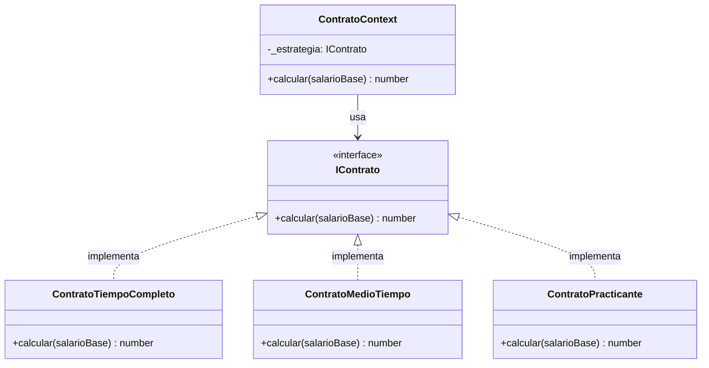

# Diagrama Strategy — Cálculo de Contrato

```mermaid
classDiagram
    class ContratoContext {
        -_estrategia: IContrato
        +calcular(salarioBase) number
    }

    class IContrato {
        <<interface>>
        +calcular(salarioBase) number
    }

    class ContratoTiempoCompleto {
        +calcular(salarioBase) number
    }

    class ContratoMedioTiempo {
        +calcular(salarioBase) number
    }

    class ContratoPracticante {
        +calcular(salarioBase) number
    }

    ContratoContext --> IContrato : usa
    IContrato <|.. ContratoTiempoCompleto : implementa
    IContrato <|.. ContratoMedioTiempo : implementa
    IContrato <|.. ContratoPracticante : implementa
```
